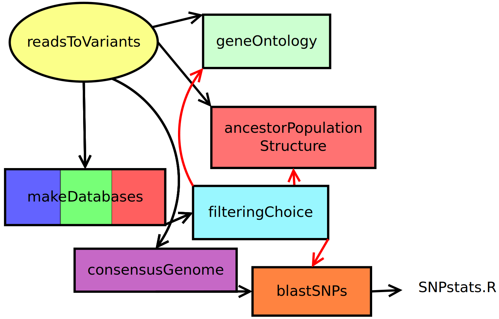
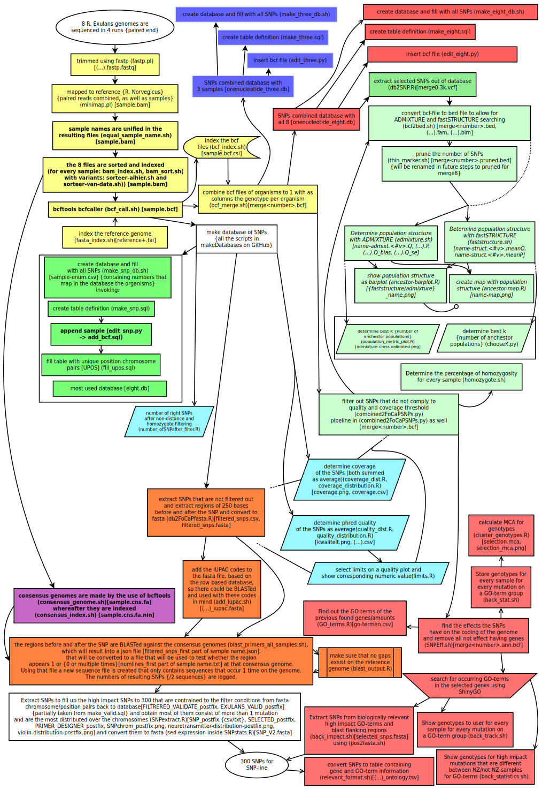

# the actual scripts

## Scripts in this directory:

telegram_message.R provides a possibility to allow telegram messages from bash scripts. Running it as bash, telegram_message.R could have one argument (the message itself that should be sent, else the message will be NA)
as bash script it modifies the files in the repo in a manner that the secret token and chat id are applied to files that require them.
These values are inputed by `read` so no argument is required
SNPextract.R could accept a lot of arguments:
1. number of required SNPs (defaults 100)
2. database file (defaults system globbing /d\*/d\*/eight.db)
3. sample-enum file (defaults system globbing /d\*/d\*/sample-enum.csv)
4. blast directory (defaults current directory)
5. SNP directory (defaults SNP-files in HOME directory)
6. posfix for output names (default to data)

## General information

Scripts that use a reference genome, will work with the REF environment variable, if available. The shell scripts will search for the path in the files.yml file, if they can find it.

Many scripts take some time to run(especially in scripts/readsToVariants folder). Because of this the slurm system is used.
This is a system that manages jobs on a server. Therefore a lot of (bash)scripts in this repository make use of sbatch and the following structure:
```bash
#!/bin/bash
# what the script does
code to parse arguments of set them on default values
[ $# -gt 0 ]&&variable1=$1||variable1=standard_argument
code that checks whether file arguments are available
if test $(that is the case);then
 sbatch <<< '#!/bin/bash
  # read code
  program_a "'"$variable1"'"
'
fi
```
Please note that sbatch is the program where jobs are made known on the server. The program the job comprend is on the next lines.
Because there is worked with '(single quote) arguments that are given are within "'" (double quote so most variables could contain spaces)

The program flow scematic:



The flowcharts are structured to all use the same color references. Every subdirectory (one field in the smallest flowchart) contains its own part of the flowchart, to improve usability of this repo. Alongside the directory color codes, bright yellow is used for scripts that are not needed when progress simply works fine.
Next to that the bigger flowchart is structured in the following ways:
* boxes
  - boxes that are circles represent symbolical start- and stop- points of the analysis
  - most boxes represent 1 or no script, some represent 2
  - parallellogram boxes are used as the very last result of something.
  - white boxes might indicate the script belongs to a directory, but is not uploaded, yet, they might also be white because of represeting "other"
  - boxes that are bold, means this should be executed for every sample
  - boxes that are italic, means this should be executed for every number of *K* (ancestor populations)
* textual conventions
  - script names are explained in between \(these characters\)
  - output is explained in between \[these characters\] this is almost always filenames, but occasionally this can be a database table, which is represented by fully use of UPPERCASE, except maybe the word postfix.
  - output of \(...\).xyz means the input filename, without the last extension (.something part of the filename) and added .xyz
  - output filename that contains *sample* is symbolical. Then the output file(s) will be the sample name, the same applies to postfix.
  - output containing \<this characters\> means a number
  - output containing {a/b}c ac and bc
  - output containing \+.ext means the filename and .ext added.
  - {} outside of output brackets means more explained about that box
* arrows
  - normal arrows represent flow of data
  - arrows ending in dotted lines represent that values are defined in the script pointed to, because of the outcome of the script pointed from
  - arrows ending in a circle represented that the script is based on the script pointed from.
  - arrows that started with a dotted line means that the script pointed to is depended on multiple runs of the "pointed from" script
  - a fully dotted line inside an arrow means "in exceptional cases"
  - a line starting dotted and in the middle switching line and empty represent developmental only


The full flowchart (not the latest version):


